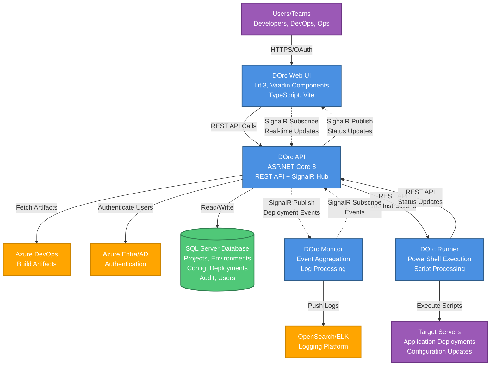

# DOrc (DevOps Orchestrator)

## Description

DOrc is a DevOps deployment orchestration engine designed for managing and executing PowerShell-based deployments across multiple environments. It provides centralized configuration management, environment control, and deployment workflow automation.

## Architecture Overview

DOrc consists of four main components working together to orchestrate deployments:



### Component Details

- **DOrc API** - ASP.NET Core 8 REST API that manages deployments, environments, and configuration
- **DOrc Web UI** - Modern web interface built with Lit 3 and Vaadin components
- **DOrc Runner** - Agent service that executes PowerShell deployment scripts on target servers
- **DOrc Monitor** - Service for monitoring and logging deployment activities

### Data Flow

1. **User Interaction**: Users interact with the Web UI to initiate deployments, manage environments, and configure projects
2. **API Processing**: The API receives requests, validates permissions, and orchestrates deployment workflows
3. **Job Execution**: The API communicates with Runner agents on target servers to execute PowerShell scripts
4. **Real-time Updates**: SignalR pushes deployment status updates to the Web UI and Monitor service
5. **Monitoring & Logging**: The Monitor service aggregates events and logs for observability

## Getting Started

### Prerequisites

**Backend Requirements:**
* .NET 8 SDK (for API and services)
* .NET Framework 4.8 SDK (for legacy PowerShell runner components)
* SQL Server (for database)
* WiX Toolset 5 (for creating installers)

**Frontend Requirements:**
* Node.js >= 14.0.0
* npm >= 7.0.0

### Installation

#### 1. Clone the Repository

```bash
git clone https://github.com/sefe/dorc.git
cd dorc
```

#### 2. Build the Backend

Open the solution in Visual Studio:

```bash
cd src
# Open Dorc.sln in Visual Studio 2022 or later
```

Build the solution to restore NuGet packages and compile all projects.

#### 3. Build the Frontend

```bash
cd src/dorc-web
npm install
npm run build
```

#### 4. Database Setup

Run database migrations and setup scripts (details in `src/Dorc.Database/`).

#### 5. Installation Package (Optional)

To create an installation package:

```bash
cd src/install-scripts
# Run the appropriate installation script
```

### Development Setup

#### Running the API

1. Set `Dorc.Api` as the startup project in Visual Studio
2. Update `appsettings.Development.json` with your database connection string
3. Press F5 to run in debug mode

The API will start on `https://localhost:5001` (or configured port).

#### Running the Web UI

```bash
cd src/dorc-web
npm run dev
```

The web application will be available at `http://localhost:8888`.

### Update Client Libraries

The project uses OpenAPI Generator to create client libraries from API specifications.

#### Regenerate DOrc API TypeScript Client

From the `src/dorc-web` directory:

```bash
npm run dorc-api-gen
```

Or manually:

```bash
openapi-generator-cli generate -g typescript-rxjs -i ./src/apis/dorc-api/swagger.json -o ./src/apis/dorc-api/ --additional-properties=supportsES6=true,npmVersion=9.4.0,typescriptThreePlus=true --skip-validate-spec
```

#### Regenerate Azure DevOps Build Client

From the appropriate directory containing `build.json`:

```bash
openapi-generator-cli generate -g csharp -i ./build.json --skip-validate-spec
```

Azure DevOps API specifications: https://github.com/MicrosoftDocs/vsts-rest-api-specs

## Project Structure

```
dorc/
├── src/
│   ├── Dorc.Api/              # Main REST API
│   ├── Dorc.Api.Client/       # API client library
│   ├── Dorc.ApiModel/         # Shared API models
│   ├── Dorc.Core/             # Core business logic
│   ├── Dorc.Database/         # Database migrations and setup
│   ├── Dorc.Monitor/          # Deployment monitoring service
│   ├── Dorc.Runner/           # PowerShell execution agent
│   ├── Dorc.PowerShell/       # PowerShell integration
│   ├── Dorc.PersistentData/   # Data access layer
│   ├── Dorc.AzureDevOps/      # Azure DevOps integration
│   ├── dorc-web/              # Web UI (see below)
│   └── install-scripts/       # Installation helpers
├── CONTRIBUTING.md
├── LICENSE.md
└── README.md
```

### Web UI Structure

See [src/dorc-web/README.md](src/dorc-web/README.md) for detailed frontend documentation.

## Technology Stack

**Backend:**
- .NET 8 / ASP.NET Core
- .NET Framework 4.8 (legacy components)
- Entity Framework Core
- SignalR (real-time updates)
- Log4net

**Frontend:**
- Lit 3 (Web Components)
- Vaadin Components 24
- Vite (build tool)
- TypeScript
- RxJS

**Testing:**
- xUnit / NUnit
- K6 (load testing)

## Development Workflow

1. Make changes to backend code in Visual Studio
2. Make changes to frontend code in your preferred editor
3. Test locally using `npm run dev` for frontend and F5 in Visual Studio for backend
4. Run linting: `npm run format` (frontend)
5. Build: `npm run build` (frontend), Build Solution (backend)
6. Commit and push changes
7. Create pull request

## Testing

### Frontend Testing

```bash
cd src/dorc-web
npm test
```

### Load Testing with K6

```bash
cd src/dorc-web/k6-tests
k6 run monitor-request-page-test.js
```

See [src/dorc-web/README.md](src/dorc-web/README.md) for more K6 testing details.

## Contributions

SEFE welcomes contributions into this solution; please refer to the CONTRIBUTING.md file for details

## Authors

The solution is designed and built by SEFE Securing Energy for Europe Gmbh.

SEFE - [Visit us online](https://www.sefe.eu/)

## License

This project is licensed under the [Apache 2.0] License - see the LICENSE-2.0.txt file for details
