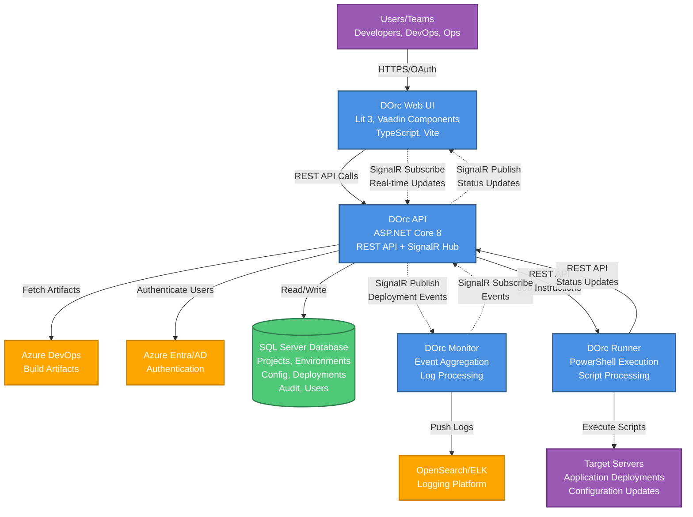

# DOrc (DevOps Orchestrator)

## Description

DOrc is a DevOps deployment orchestration engine designed for managing and executing PowerShell-based deployments across multiple environments. It provides centralized configuration management, environment control, and deployment workflow automation.

## Architecture Overview

DOrc consists of four main components working together to orchestrate deployments:


```mermaid
graph TB
    %% Users and External Systems
    Users["Users/Teams<br/>Developers, DevOps, Ops"]
    AzureDevOps["Azure DevOps<br/>Build Artifacts"]
    AzureEntra["Azure Entra/AD<br/>Authentication"]
    OpenSearch["OpenSearch/ELK<br/>Logging Platform"]
    
    %% Core Components
    WebUI["DOrc Web UI<br/>Lit 3, Vaadin Components<br/>TypeScript, Vite"]
    API["DOrc API<br/>ASP.NET Core 8<br/>REST API + SignalR Hub"]
    Database[("SQL Server Database<br/>Projects, Environments<br/>Config, Deployments<br/>Audit, Users")]
    Monitor["DOrc Monitor<br/>Event Aggregation<br/>Log Processing"]
    Runner["DOrc Runner<br/>PowerShell Execution<br/>Script Processing"]
    TargetServers["Target Servers<br/>Application Deployments<br/>Configuration Updates"]
    
    %% User Interactions
    Users -->|HTTPS/OAuth| WebUI
    
    %% Web UI to API
    WebUI -->|REST API Calls| API
    WebUI -.->|SignalR Subscribe<br/>Real-time Updates| API
    
    %% API Connections
    API -->|Read/Write| Database
    API -->|Fetch Artifacts| AzureDevOps
    API -->|Authenticate Users| AzureEntra
    API -.->|SignalR Publish<br/>Deployment Events| Monitor
    API -.->|SignalR Publish<br/>Status Updates| WebUI
    API -->|REST API<br/>Job Instructions| Runner
    
    %% Monitor Connections
    Monitor -.->|SignalR Subscribe<br/>Events| API
    Monitor -->|Push Logs| OpenSearch
    
    %% Runner Connections
    Runner -->|REST API<br/>Status Updates| API
    Runner -->|Execute Scripts| TargetServers
    
    %% Styling
    classDef coreComponent fill:#4A90E2,stroke:#2E5C8A,stroke-width:2px,color:#fff
    classDef database fill:#50C878,stroke:#2E7D4E,stroke-width:2px,color:#fff
    classDef external fill:#FFA500,stroke:#CC8400,stroke-width:2px,color:#fff
    classDef user fill:#9B59B6,stroke:#6C3483,stroke-width:2px,color:#fff
    
    class WebUI,API,Monitor,Runner coreComponent
    class Database database
    class AzureDevOps,AzureEntra,OpenSearch external
    class Users,TargetServers user
```

### Component Details

- **DOrc API** - ASP.NET Core 8 REST API that manages deployments, environments, and configuration
- **DOrc Web UI** - Modern web interface built with Lit 3 and Vaadin components
- **DOrc Runner** - Agent service that executes PowerShell deployment scripts on target servers
- **DOrc Monitor** - Service for monitoring and logging deployment activities

### Data Flow

1. **User Interaction**: Users interact with the Web UI to initiate deployments, manage environments, and configure projects
2. **API Processing**: The API receives requests, validates permissions, and orchestrates deployment workflows
3. **Job Execution**: The API communicates with Runner agents on target servers to execute PowerShell scripts
4. **Real-time Updates**: SignalR pushes deployment status updates to the Web UI and Monitor service
5. **Monitoring & Logging**: The Monitor service aggregates events and logs for observability

## Getting Started

### Prerequisites

**Backend Requirements:**
* .NET 8 SDK (for API and services)
* .NET Framework 4.8 SDK (for legacy PowerShell runner components)
* SQL Server (for database)
* WiX Toolset 5 (for creating installers)

**Frontend Requirements:**
* Node.js >= 14.0.0
* npm >= 7.0.0

### Installation

#### 1. Clone the Repository

```bash
git clone https://github.com/sefe/dorc.git
cd dorc
```

#### 2. Build the Backend

Open the solution in Visual Studio:

```bash
cd src
# Open Dorc.sln in Visual Studio 2022 or later
```

Build the solution to restore NuGet packages and compile all projects.

#### 3. Build the Frontend

```bash
cd src/dorc-web
npm install
npm run build
```

#### 4. Database Setup

Run database migrations and setup scripts (details in `src/Dorc.Database/`).

#### 5. Installation Package (Optional)

To create an installation package:

```bash
cd src/install-scripts
# Run the appropriate installation script
```

### Development Setup

#### Running the API

1. Set `Dorc.Api` as the startup project in Visual Studio
2. Update `appsettings.Development.json` with your database connection string
3. Press F5 to run in debug mode

The API will start on `https://localhost:5001` (or configured port).

#### Running the Web UI

```bash
cd src/dorc-web
npm run dev
```

The web application will be available at `http://localhost:8888`.

### Update Client Libraries

The project uses OpenAPI Generator to create client libraries from API
specifications. CI regenerates the TypeScript clients on every build and
fails if the committed code differs from the generator output, so specs and
clients must always be committed together.

From the `src/dorc-web` directory:

```bash
npm run api-gen             # regenerate both clients from the committed specs
npm run dorc-api-gen        # DOrc API TypeScript client (from src/apis/dorc-api/swagger.json)
npm run ado-build-csharp-gen # Azure DevOps Build C# client (from src/Dorc.AzureDevOps/build.json)
```

When a C# controller or API model changes, update
`src/dorc-web/src/apis/dorc-api/swagger.json` to match (a running API serves
the document at `/swagger/v1/swagger.json`) and regenerate. Every generated
tree is pure generator output — app concerns live alongside, not inside:

- Web: base URL and OAuth tokens are supplied through the generated
  `Configuration` class from
  `src/dorc-web/src/services/dorc-api-configuration.ts`. See
  [src/dorc-web/README.md](src/dorc-web/README.md).
- C# (`src/Dorc.AzureDevOps`, consumed by `Dorc.Core`, the Monitor and the
  TerraformRunner for build numbers and artifact locations): AAD token
  generation and the count/value list-envelope handling live in the
  `Dorc.AzureDevOps.Client` project, wired in through the generated
  `Configuration`/`ApiClient` classes. The client csproj is dependabot-owned
  and excluded from generation via that tree's `.openapi-generator-ignore`.

The Azure DevOps Build spec is authoritative at
[MicrosoftDocs/vsts-rest-api-specs](https://github.com/MicrosoftDocs/vsts-rest-api-specs)
(`specification/build/6.0/build.json`). Generation itself reads only the
committed `src/Dorc.AzureDevOps/build.json`, so builds are hermetic and an
upstream change can never turn an unrelated pull request red. The
`ado-build-spec-refresh` workflow owns adopting upstream: it runs weekly (and
on demand), fetches the official document, regenerates, and opens a pull
request when anything changed. To do it by hand:

```bash
npm run ado-build-spec-refresh   # update the committed build.json from upstream
npm run api-gen                  # regenerate against it
```

### Database access management (side-by-side pilot)

The **Database access (new)** panel under environment database details manages
database-native users, directory-backed database principals, roles and role
memberships. It does not replace the legacy Users or Permissions controls yet.
Work is tracked by #945 and its children #946-#953.

Deploy the updated database project before enabling the feature. It adds
`DatabaseAccessConfiguration`, `DatabaseAccessPrincipal`, `DatabaseAccessRole`,
`DatabaseAccessMembership` and `DatabaseAccessAudit`; it does not alter or import
`USERS`, `ENVIRONMENT_USER_MAP` or `PERMISSION`. The provider is stored separately
from `DATABASE.DB_Type`, which remains an application-tag field.

The API defaults to:

```json
"DatabaseAccess": {
  "Enabled": false,
  "ExecutionEnabled": false,
  "DatabaseIds": []
}
```

An operator must explicitly enable the feature and allowlist database IDs.
`ExecutionEnabled` independently controls mutations to target databases. Keep it
false while reviewing/importing desired state. The feature uses new
`DatabaseAccess/{envId}/{databaseId}` endpoints, not the legacy user contracts.
Access requires environment modification rights; changes and target discovery
also require rights on every environment sharing the database.

The first provider is `sql-server`. Additional engines require an
`IDatabaseAccessProvider` registration; unsupported providers fail explicitly.
The initial SQL Server capability includes database-user creation/remapping/
removal against **existing server logins**, custom-role creation/removal, and
role membership changes. It does not provision server logins or passwords,
manage object-level grants, or modify protected/system principals and roles.
`public`, `db_owner`, `db_securityadmin` and `db_accessadmin` are protected.
Reference-only roles must already exist. Only explicitly managed absent
principals/roles are removed; objects found through discovery are not adopted
or deleted implicitly.

Target connections use the API process's Windows identity, encrypted SQL
connections and certificate validation. Configure trusted SQL Server certificates
and grant only the permissions needed: `VIEW DEFINITION` for discovery, sufficient
server-login metadata visibility, and the appropriate `ALTER ANY USER`,
`ALTER ANY ROLE`/role permissions for approved mutations. Do not grant
`sysadmin` merely to enable this feature. Existing AD users/groups are resolved
through the AD searcher; the new principal records store stable SID references
and database aliases, not directory profile copies. Deleted identities and
directory outages are reported, not treated as successful empty lookups.

**Migration procedure**

1. Enable a pilot database, leaving target execution disabled.
2. Open the new panel and preview a legacy import. Supply explicit JSON maps
   from legacy permission names to existing database role names, for example
   `{"Read":"db_datareader"}`. Windows records additionally require a map from
   legacy user IDs to verified AD SIDs. Resolve all reported conflicts.
3. Confirm the import into desired state. `Endur` and `Sql` accounts become
   native database principals. No legacy or target data is changed.
4. Review desired principals/roles and run **Discover and preview target
   changes**. Review the operations, observed state and errors. Desired edits,
   legacy edits and target changes invalidate applicable previews.
5. After operational approval, enable target execution and apply the confirmed
   preview. SQL Server changes run in one transaction; failures roll back.
   A database-scoped DOrc lock serializes changes across API instances.
6. Inspect recent audit records, remaining drift and import divergence.
   Repeating the same import does not duplicate data. Later legacy edits are
   not dual-written; removed/remapped assignments are reported for explicit
   resolution. An audit left `Started` or `FailedOrUncertain` requires target
   rediscovery before retrying, especially following a connection/process failure.

Disabling `ExecutionEnabled` stops new target mutations, not an in-flight
transaction and not changes already committed. Disabling the feature removes
access to the new stack without reverting legacy data. Back up the new metadata
before maintenance; configured databases have protective foreign keys and
cannot be deleted while their configuration remains. Keep the legacy stack
available until the Endur team signs off, migration conflicts and drift are
resolved, and an agreed observation period shows no remaining legacy usage.
Production rollout (#952) and removal (#953) are separate operator-approved
changes. This implementation does not migrate external deployment scripts or
post-restore consumers automatically; inventory and migrate those consumers
before legacy decommissioning.

For isolated SQL integration coverage on Windows:

```powershell
SqlLocalDB create DOrcAccessTests -s
$env:DORC_ACCESS_TEST_SERVER = '(localdb)\DOrcAccessTests'
dotnet test .\src\Dorc.Core.Tests\Dorc.Core.Tests.csproj --configuration Release --filter FullyQualifiedName~DatabaseAccess
```

The SQL test accepts only that named LocalDB instance, creates randomly named
test databases/logins, and removes them in cleanup. Never point tests at a
shared production database.

## Project Structure

```
dorc/
├── src/
│   ├── Dorc.Api/              # Main REST API
│   ├── Dorc.Api.Client/       # API client library
│   ├── Dorc.ApiModel/         # Shared API models
│   ├── Dorc.Core/             # Core business logic
│   ├── Dorc.Database/         # Database migrations and setup
│   ├── Dorc.Monitor/          # Deployment monitoring service
│   ├── Dorc.Runner/           # PowerShell execution agent
│   ├── Dorc.PowerShell/       # PowerShell integration
│   ├── Dorc.PersistentData/   # Data access layer
│   ├── Dorc.AzureDevOps/      # Azure DevOps integration
│   ├── dorc-web/              # Web UI (see below)
│   └── install-scripts/       # Installation helpers
├── CONTRIBUTING.md
├── LICENSE.md
└── README.md
```

### Web UI Structure

See [src/dorc-web/README.md](src/dorc-web/README.md) for detailed frontend documentation.

## Technology Stack

**Backend:**
- .NET 8 / ASP.NET Core
- .NET Framework 4.8 (legacy components)
- Entity Framework Core
- SignalR (real-time updates)
- Log4net

**Frontend:**
- Lit 3 (Web Components)
- Vaadin Components 24
- Vite (build tool)
- TypeScript
- RxJS

**Testing:**
- xUnit / NUnit
- K6 (load testing)

## Development Workflow

1. Make changes to backend code in Visual Studio
2. Make changes to frontend code in your preferred editor
3. Test locally using `npm run dev` for frontend and F5 in Visual Studio for backend
4. Run linting: `npm run format` (frontend)
5. Build: `npm run build` (frontend), Build Solution (backend)
6. Commit and push changes
7. Create pull request

## Testing

### Frontend Testing

```bash
cd src/dorc-web
npm test
```

### Load Testing with K6

```bash
cd src/dorc-web/k6-tests
k6 run monitor-request-page-test.js
```

See [src/dorc-web/README.md](src/dorc-web/README.md) for more K6 testing details.

## Contributions

SEFE welcomes contributions into this solution; please refer to the CONTRIBUTING.md file for details

## Authors

The solution is designed and built by SEFE Securing Energy for Europe Gmbh.

SEFE - [Visit us online](https://www.sefe.eu/)

## License

This project is licensed under the [Apache 2.0] License - see the LICENSE-2.0.txt file for details
